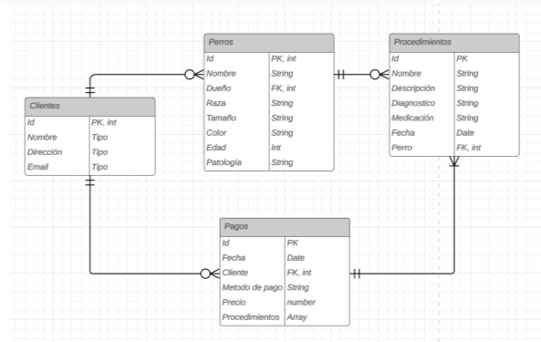
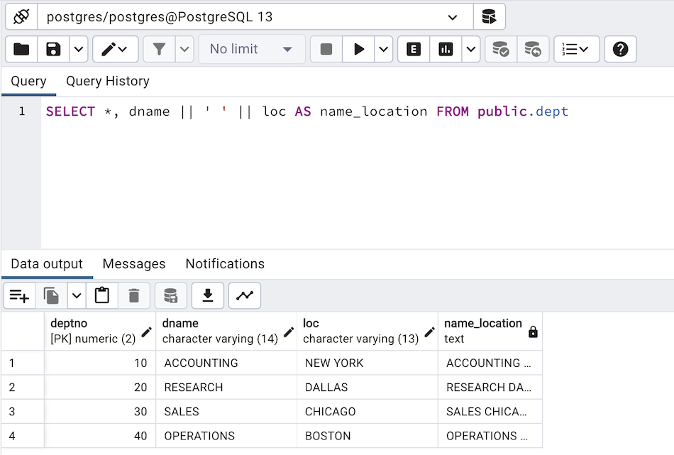

# Trabajo Práctico N°5

## _Autoras:_ 
* Berrino Eugenia
* Vazquez Chenlo Aylin

## **PARTE 1:** Bases de Datos

### 1. ¿Qué tipo de base de datos es? 

Respuesta

### 2. Armar el diagrama de entidad relación. 


### 3. Considera que la base de datos está normalizada. En caso que no lo esté, ¿cómo podría hacerlo?

Respuesta

## **PARTE 2:** Bases de Datos

### 1. Obtener el nombre y la dirección de los pacientes que viven en Buenos Aires.

```
query 1
```



### 2. Obtener la cantidad de recetas emitidas por cada médico.

```
query 2
```


### 3. Obtener el nombre de los pacientes junto con la fecha y el diagnóstico de todas las consultas médicas realizadas en junio del 2024.

```
query 3
```


### 4. Obtener el nombre de los medicamentos prescritos más de una vez por el médico con ID igual a 2.

```
query 4
```


### 5. Obtener el nombre de los pacientes junto con la cantidad total de recetas que han recibido.

```
query 5
```


### 6.Obtener el nombre del medicamento más recetado junto con la cantidad de recetas emitidas para ese medicamento.

```
query 6
```


### 7. Obtener el nombre del paciente junto con la fecha de su última consulta y el diagnóstico asociado.

```
query 7
```


### 8. Obtener el nombre del médico junto con el nombre del paciente y el número total de consultas realizadas por cada médico para cada paciente, ordenado por médico y paciente.

```
query 8
```


### 9.Obtener el nombre del medicamento junto con el total de recetas prescritas para ese medicamento, el nombre del médico que lo recetó y el nombre del paciente al que se le recetó, ordenado por total de recetas en orden descendente.

```
query 9
```


### 10.Obtener el nombre del médico junto con el total de pacientes a los que ha atendido, ordenado por el total de pacientes en orden descendente.

```
query 10
```
